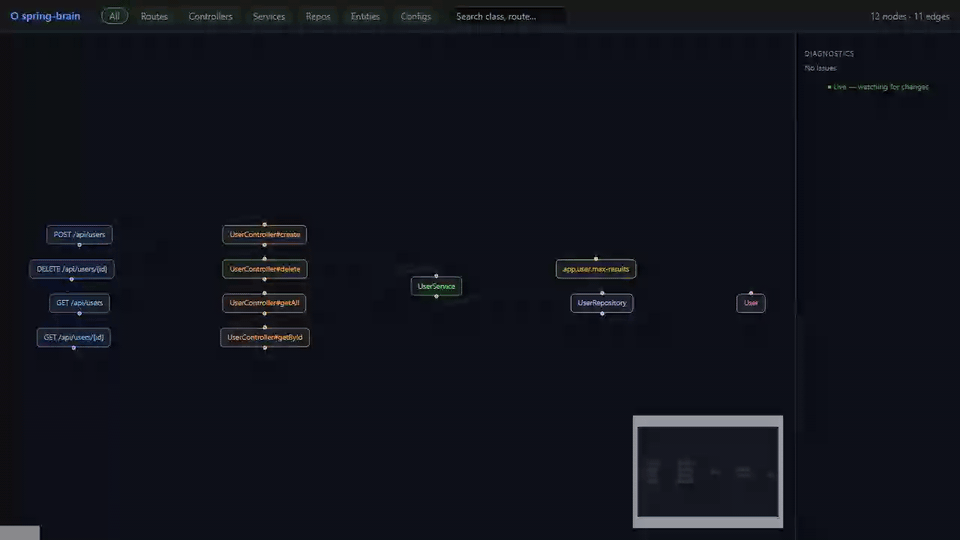

# Spring Brain

[](https://github.com/samuelhany-cpu/Spring-Brain/actions/workflows/ci.yml)
[](LICENSE)

> Architecture intelligence for Spring Boot.

Spring Brain is an open-source CLI tool that statically scans a Spring Boot codebase and generates an architecture report showing `Route → Controller → Service → Repository → Entity` flows, broken links, and architecture diagnostics.

---

## Viewer Preview



---

## Quick Start

### Prerequisites

- Java 21+
- Maven 3.9+

### Build

```bash
git clone https://github.com/samuelhany-cpu/Spring-Brain.git
cd Spring-Brain
mvn package -DskipTests
```

### Run the CLI

```bash
java -jar spring-brain-cli/target/spring-brain-cli-0.2.0.jar --help
```

### Scan a Spring Boot project

```bash
java -jar spring-brain-cli/target/spring-brain-cli-0.2.0.jar scan --path ./spring-brain-samples/clean-crud-app
```

### Run Tests

```bash
mvn test
```

---

## Usage

### Basic scan

Point `--path` at any Spring Boot project root:

```bash
java -jar spring-brain-cli/target/spring-brain-cli-0.2.0.jar scan --path /path/to/your-spring-app
```

Example output printed to the terminal:

```text
Spring Brain — Static Analysis
================================
Project path : /path/to/your-spring-app
Output path  : /path/to/your-spring-app/.spring-brain

Scanning sources...
Building graph...
Running diagnostics...

Results
-------
  Controllers : 5
  Services    : 4
  Repositories: 4
  Entities    : 6
  Routes      : 18
  Errors      : 0
  Warnings    : 2

Output written to: /path/to/your-spring-app/.spring-brain
```

### Custom output directory

```bash
java -jar spring-brain-cli/target/spring-brain-cli-0.2.0.jar scan \
  --path /path/to/your-spring-app \
  --output /tmp/my-report
```

### Launch the interactive viewer

```bash
java -jar spring-brain-cli/target/spring-brain-cli-0.2.0.jar serve \
  --path /path/to/your-spring-app
```

Scans the project, starts a local HTTP server, and opens the browser at `http://localhost:3000`. The viewer auto-refreshes when output files change.

```bash
# Custom port
java -jar spring-brain-cli/target/spring-brain-cli-0.2.0.jar serve \
  --path /path/to/your-spring-app \
  --port 8080

# Or launch the viewer directly from the scan command
java -jar spring-brain-cli/target/spring-brain-cli-0.2.0.jar scan \
  --path /path/to/your-spring-app \
  --serve
```

Press `Ctrl+C` to stop the server.

### Fail the build on errors (CI usage)

```bash
java -jar spring-brain-cli/target/spring-brain-cli-0.2.0.jar scan \
  --path /path/to/your-spring-app \
  --fail-on-error
```

Exits with code `2` if any `ERROR` diagnostics are found. Useful in CI pipelines to enforce architecture rules.

---

## Output

After a successful scan, Spring Brain writes to `.spring-brain/` (or `--output <dir>`):

```text
.spring-brain/
├── graph.json        ← Architecture graph (nodes + edges)
├── diagnostics.json  ← Broken links and rule violations
└── summary.md        ← Human-readable report
```

---

## Project Structure

```text
spring-brain/
├── spring-brain-core/       # Domain logic, scanner, graph, diagnostics
├── spring-brain-cli/        # Picocli CLI entry point
├── spring-brain-server/     # Planned: local HTTP API
├── spring-brain-viewer/     # React graph viewer (React Flow + Vite)
├── spring-brain-samples/
│   ├── clean-crud-app/                          # Clean reference app (0 diagnostics)
│   ├── broken-controller-without-service-app/   # Triggers CONTROLLER_WITHOUT_SERVICE
│   ├── broken-controller-direct-repository-app/ # Triggers CONTROLLER_DIRECT_REPOSITORY
│   ├── broken-missing-repository-app/           # Triggers MISSING_REPOSITORY_BEAN
│   ├── broken-repository-entity-mismatch-app/   # Triggers REPOSITORY_ENTITY_MISMATCH
│   └── broken-config-property-app/              # Triggers MISSING_CONFIG_PROPERTY
├── docs/
│   ├── PRD.md
│   ├── ARCHITECTURE.md
│   ├── MVP_PLAN.md
│   ├── GRAPH_SCHEMA.md
│   ├── DIAGNOSTIC_RULES.md
│   └── ROADMAP.md
└── pom.xml
```

---

## CLI Commands

| Command | Description |
|---------|-------------|
| `--help` | Show help |
| `scan --path <dir>` | Scan a Spring Boot project |
| `scan --path <dir> --output <dir>` | Custom output directory |
| `scan --path <dir> --fail-on-error` | Exit 2 on ERROR diagnostics |
| `scan --path <dir> --serve` | Scan + open interactive viewer |
| `scan --path <dir> --serve --port <n>` | Viewer on custom port |
| `serve --path <dir>` | Scan + open viewer (shorthand) |
| `serve --path <dir> --port <n>` | Viewer on custom port |

---

## Exit Codes

| Code | Meaning |
|------|---------|
| 0 | Success |
| 1 | Tool error (invalid path, etc.) |
| 2 | Scan succeeded but ERROR diagnostics found (with `--fail-on-error`) |

---

## Documentation

| Document | Description |
|----------|-------------|
| [docs/PRD.md](docs/PRD.md) | Product requirements |
| [docs/ARCHITECTURE.md](docs/ARCHITECTURE.md) | Architecture and module design |
| [docs/MVP_PLAN.md](docs/MVP_PLAN.md) | Milestone plan |
| [docs/GRAPH_SCHEMA.md](docs/GRAPH_SCHEMA.md) | Graph JSON schema |
| [docs/DIAGNOSTIC_RULES.md](docs/DIAGNOSTIC_RULES.md) | Diagnostic rule definitions |
| [docs/ROADMAP.md](docs/ROADMAP.md) | Future roadmap |

---

## Tech Stack

**CLI / Core**
- Java 21
- Spring Boot 3.x (BOM only; CLI has no Spring context)
- Maven multi-module
- JavaParser 3.x
- Picocli 4.x
- Jackson 2.x
- JUnit 5 + AssertJ

**Viewer**
- React 18 + TypeScript 5 + Vite 5
- React Flow 11 + dagre auto-layout
- Tailwind CSS 3
- Vitest + Playwright E2E

---

## Status

**v0.2.0 — Interactive Viewer** ✅

| Milestone | Status |
|-----------|--------|
| 0 — Project Bootstrap | ✅ |
| 1 — Static Scanner | ✅ |
| 2 — Graph Builder | ✅ |
| 3 — Broken Link Detector | ✅ |
| 4 — Summary Report | ✅ |
| 5 — Release Candidate | ✅ |
| 6 — Interactive Viewer | ✅ |

182 Java tests · 27 Vitest unit tests · 9 Playwright e2e tests pass. Produces `graph.json`, `diagnostics.json`, and `summary.md` from any Spring Boot source tree, and serves them in an interactive React Flow graph viewer.

---

## Current Limitations

Spring Brain is an early-stage tool. Keep these constraints in mind:

- **Static analysis only** — the target Spring Boot application is never started or executed.
- **Scans `src/main/java` only** — generated sources, annotation-processed code, and Kotlin sources are not scanned.
- **Java only** — Kotlin Spring Boot projects are not yet supported.
- **Spring mapping detection is partial** — `@RequestMapping` without an explicit `method` attribute is reported as `ANY`. Complex composed annotations may be missed.
- **Symbol resolution is approximate** — full classpath resolution is not performed; injection matching is done by simple class name.
- **Config scanning covers `.properties` files and basic `.yml`/`.yaml` flat keys** — complex YAML anchors, references, and multi-document files are not supported.
- **Bean dependency graph is experimental** — Phase 3 features may produce false positives on some project structures.
- **Security analysis uses simple patterns only** — not a substitute for a real security audit.
- **`serve` command requires the viewer to be built separately** — the server module is a work in progress.

---

## Contributing

Contributions are welcome. Please open an issue first to discuss what you would like to change.

Suggested GitHub topics: `spring-boot` `java` `static-analysis` `architecture` `cli` `developer-tools` `graph` `diagnostics`

---

## License

[MIT](LICENSE)
